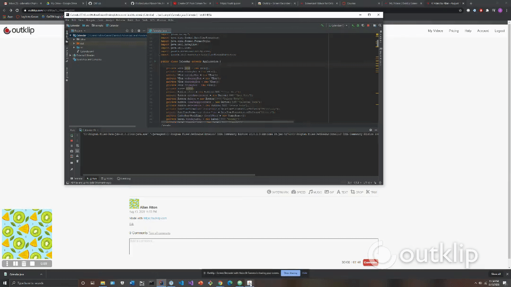

# Calendar Application

An Java application that allows you to schedule notes, clear notes, delete notes and open notes on a calendar.
Implementing JavaFx GUI's, basic event handling, enumerations and using API Classes.

Submitted by: Allan Atton

Time spent: 3 hours

## Video Walkthrough 

Here's a walkthrough of implemented user stories:

## License

Copyright 2019 Allan Atton

Licensed under the Apache License, Version 2.0 (the "License");
you may not use this file except in compliance with the License.
You may obtain a copy of the License at

Unless required by applicable law or agreed to in writing, software
distributed under the License is distributed on an "AS IS" BASIS,
WITHOUT WARRANTIES OR CONDITIONS OF ANY KIND, either express or implied.
See the License for the specific language governing permissions and
limitations under the License.
